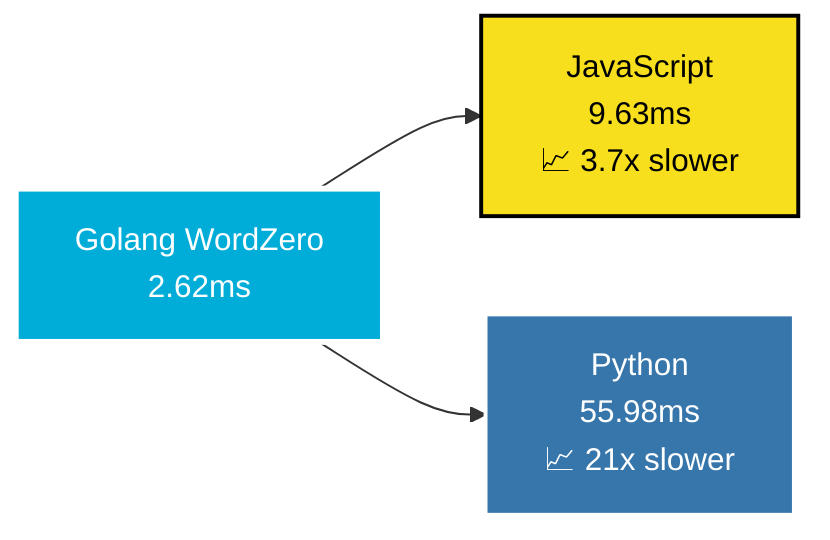
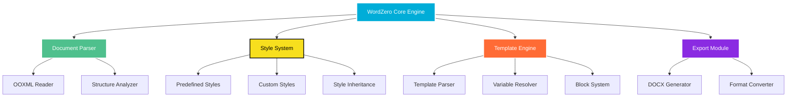

# 🚀 欢迎来到 ZeroHawkeye 的世界 🌟

<div align="center">


[](https://git.io/typing-svg)

<p align="center">
  
</p>

### 💫 连接世界，编织未来
[](https://github.com/ZeroHawkeye)
[](mailto:clown166997982@gmail.com)
[](https://github.com/ZeroHawkeye)
[](https://github.com/ZeroHawkeye?tab=followers)

</div>

---

<details>
<summary>🎯 <b>点击展开 - 关于我的故事</b></summary>
<br>

<div align="center">

### 🌟 技术之路，永无止境

```ascii
    🌱 Started Journey        🚀 Current Level         🎯 Future Goals
         │                         │                      │
    ┌────▼────┐              ┌─────▼─────┐          ┌─────▼─────┐
    │ Student │──────────────▶│ Developer │─────────▶│  Expert   │
    └─────────┘              └───────────┘          └───────────┘
        2020                     2024                   2026+
```

</div>

**🎭 我的技术哲学：**
> *"代码不仅仅是逻辑的堆砌，更是思想与创意的完美融合。每一行代码都承载着改变世界的可能。"*

**💼 专业标签：**
- 🔭 **核心项目：** [WordZero](https://github.com/ZeroHawkeye/wordZero) - 革命性的Golang Word文档处理引擎
- 🌱 **技术栈：** Golang • Vue.js • Redis • MySQL • MongoDB • Docker
- 🎯 **专业领域：** 高并发后端架构 • 文档处理算法 • 全栈Web开发 • 微服务设计
- ⚡ **开源影响：** 169+ Stars • 8+ Forks • 活跃开源贡献者
- 🌍 **协作方式：** 远程优先 • 敏捷开发 • 代码审查
- 📫 **商务合作：** clown166997982@gmail.com

</details>

---

<div align="center">

## 🏆 明星项目展示台


### 🌟 WordZero - 下一代Golang文档处理引擎

<a href="https://github.com/ZeroHawkeye/wordZero">
  
</a>

<div align="center">
  <table>
    <tr>
      <td align="center">
        
      </td>
      <td align="center">
        
      </td>
      <td align="center">
        
      </td>
    </tr>
    <tr>
      <td align="center">
        
      </td>
      <td align="center">
        
      </td>
      <td align="center">
        
      </td>
    </tr>
  </table>
</div>

### 🎯 项目特色与技术亮点

<div align="center">
  <table>
    <tr>
      <td align="center" width="33%">
        
        <h4>🚀 零依赖架构</h4>
        <p>纯Go实现，无外部依赖<br/>轻量级，易于集成</p>
      </td>
      <td align="center" width="33%">
        
        <h4>⚡ 极致性能</h4>
        <p>平均处理速度 2.62ms<br/>比Python快21倍</p>
      </td>
      <td align="center" width="33%">
        
        <h4>🎨 丰富功能</h4>
        <p>18种预定义样式<br/>完整OOXML支持</p>
      </td>
    </tr>
  </table>
</div>

### 📊 性能基准测试对比



</div>

---

<div align="center">

## 💻 技术宇宙图谱


</div>

<div align="center">
  <table>
    <tr>
      <td valign="top" width="50%">

### 🌐 后端宇宙
<div align="center">


**🔧 框架工具**


</div>
      </td>
      <td valign="top" width="50%">

### 🎨 前端星系
<div align="center">


**🎭 UI框架**


</div>
      </td>
    </tr>
    <tr>
      <td valign="top">

### 🗄️ 数据银河
<div align="center">


**⚡ 缓存 & 队列**


</div>
      </td>
      <td valign="top">

### 🛠️ 工具箱
<div align="center">


**☁️ 云服务**


</div>
      </td>
    </tr>
  </table>
</div>

---

<div align="center">

## 📊 数据驱动的成长轨迹


<div align="center">
  <table>
    <tr>
      <td align="center">
        
      </td>
      <td align="center">
        
      </td>
    </tr>
    <tr>
      <td colspan="2" align="center">
        
      </td>
    </tr>
  </table>
</div>

### 🎯 项目成就统计

<div align="center">
  <table>
    <tr>
      <td align="center">
        
      </td>
      <td align="center">
        
      </td>
      <td align="center">
        
      </td>
    </tr>
    <tr>
      <td align="center">
        
      </td>
      <td align="center">
        
      </td>
      <td align="center">
        
      </td>
    </tr>
  </table>
</div>

</div>

---

<div align="center">

## 🎨 代码活动热力图


### 🏆 成就徽章收藏


</div>

---

<div align="center">

## 💫 技术雷达图

```mermaid
radar
    title ZeroHawkeye's Tech Radar
    "Backend Development" : 0.9
    "Frontend Development" : 0.8
    "Database Design" : 0.85
    "DevOps & Cloud" : 0.7
    "Algorithm & DS" : 0.8
    "System Architecture" : 0.85
    "Open Source" : 0.9
    "Team Leadership" : 0.75
```

</div>

---

<details>
<summary>🚀 <b>点击展开 - 深入了解 WordZero 项目</b></summary>
<br>

<div align="center">

### 📈 WordZero 技术架构图



### 🔥 核心优势对比

| 特性 | WordZero | 其他方案 | 优势 |
|------|----------|----------|------|
| 🚀 **性能** | 2.62ms | 55.98ms+ | **21x 更快** |
| 📦 **依赖** | 零依赖 | 多个依赖包 | **轻量级** |
| 🎨 **样式** | 18种预定义 | 有限支持 | **功能丰富** |
| 🔧 **模板** | 继承机制 | 基础模板 | **高级特性** |
| 📄 **格式** | 完整OOXML | 部分支持 | **标准兼容** |

</div>

</details>

---

<div align="center">

## 🌐 联系矩阵 & 协作邀请


<div align="center">
  <table>
    <tr>
      <td align="center" width="25%">
        
        <h4>📧 商务合作</h4>
        <a href="mailto:clown166997982@gmail.com">
          
        </a>
        <p><i>项目合作 • 技术咨询</i></p>
      </td>
      <td align="center" width="25%">
        
        <h4>🐙 开源世界</h4>
        <a href="https://github.com/ZeroHawkeye">
          
        </a>
        <p><i>代码分享 • 项目协作</i></p>
      </td>
      <td align="center" width="25%">
        
        <h4>🌟 核心项目</h4>
        <a href="https://github.com/ZeroHawkeye/wordZero">
          
        </a>
        <p><i>文档处理 • 技术创新</i></p>
      </td>
      <td align="center" width="25%">
        
        <h4>💡 技术交流</h4>
        <a href="https://github.com/ZeroHawkeye?tab=repositories">
          
        </a>
        <p><i>知识分享 • 社区建设</i></p>
      </td>
    </tr>
  </table>
</div>

### 🤝 寻找志同道合的伙伴

<div align="center">

> **"独行快，众行远"** 🌟  
> 如果您对以下领域感兴趣，欢迎与我交流合作：

**🎯 合作方向**
- 🔥 **Golang生态建设** - 高性能后端服务开发
- 🎨 **Vue.js前端创新** - 现代化用户界面设计  
- 📄 **文档处理技术** - 办公自动化解决方案
- 🌐 **开源项目贡献** - 推动技术社区发展
- 🚀 **技术分享交流** - 知识传播与学习成长

**💌 期待您的联系！**

</div>

</div>

---

<div align="center">

## 🎉 感谢您的关注


**⭐ 如果您觉得我的项目有价值，请不要吝啬您的Star！ ⭐**

[](https://github.com/ZeroHawkeye?tab=followers)
[](https://github.com/ZeroHawkeye/wordZero)

<div align="center">
  
</div>

### 🚀 让我们一起构建更美好的开源世界！

---

<p align="center">
  
</p>

**📅 最后更新:** 2024年12月 | **🔢 版本:** v2.0.0 | **💖 用心制作**

</div>
